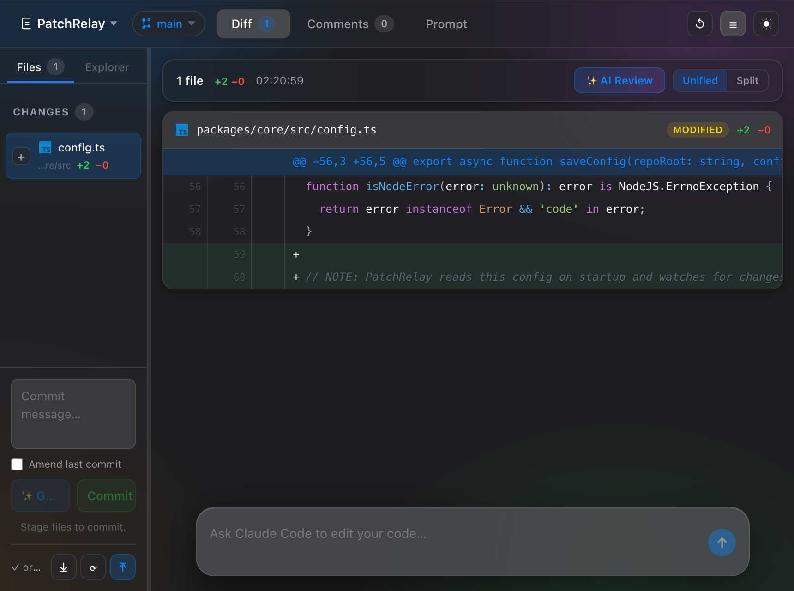

# PatchRelay

**A local, AI-native code-review IDE that lives inside your git repository.**

PatchRelay opens your working tree in the browser, lets you review diffs and leave inline comments, runs an **AI reviewer** over your changes, and gives you GitLens-grade git management — branches, stash, blame, commit history, cherry-pick, revert, reset, tags, and remote sync — without leaving the tool. Send your diff + comments to Claude Code or Codex and watch the response stream back in a chat panel, then stage and commit.

Everything runs on `localhost`. Your code never leaves your machine except through the AI CLI you already use.



## Features

### Code review
- **Diff viewer** — staged, unstaged, and untracked files with syntax-highlighted hunks
- **Split & unified views** — toggle per the GitHub/Bitbucket convention you're used to
- **Inline comments** — click any line to leave a review comment; comments anchor to lines and survive edits
- **AI Code Review** — one click sends the diff to Claude, which returns severity-tagged findings anchored as inline comments
- **Symbol jump** — double-click a function/identifier in a diff to jump to its definition in the file
- **Git blame** — inline per-line author, date, and commit summary in a gutter

### Git management (GitLens / IntelliJ-grade)
- **Branches** — switch, create, create-at-commit, delete, and **merge** from the UI
- **Branch compare** — diff your current branch against any other branch
- **Commit history** — browse the log; per-commit actions: copy hash, new branch, tag, **cherry-pick**, **revert**, **reset** (soft · mixed · hard)
- **Stash** — save, list, apply, and drop stashes
- **Staging & commit** — stage/unstage files, write a commit message (or **generate one with AI**), **amend** the last commit, and **discard** file changes
- **Tags** — create annotated/lightweight tags at any commit
- **Remote sync** — push, pull, fetch, with ahead/behind status

### AI workspace
- **Streaming chat** — send your diff + comments to Claude Code or Codex; responses render as Markdown, token-by-token
- **Provider & model picker** — Claude (Sonnet 4.6, Opus 4.8, Haiku 4.5) or Codex (models discovered from your local Codex install)
- **Reasoning effort** — a slider to dial Claude's reasoning level up or down
- **Session history** — browse and switch between past Claude Code and Codex sessions

## Quick start

### One-click install

```bash
curl -fsSL https://raw.githubusercontent.com/Elliott-byte/PatchRelay/main/scripts/install.sh | bash
```

This checks your toolchain (Node 18+), clones the repo (to `~/.patchrelay-app` by default — override with `PATCHRELAY_DIR`), builds every package, and links the `patchrelay` command globally. Then, from inside any git repository:

```bash
patchrelay
```

> Already have a checkout? Run `./scripts/install.sh` from the repo root to build and link in place.

### Manual install

```bash
git clone https://github.com/Elliott-byte/PatchRelay.git
cd PatchRelay
npm install
npm start          # builds, then serves the app and opens your browser
```

## Development

```bash
npm install
npm run dev        # api server on :3766 + Vite dev server on :5173 (HMR, auto-opens)
```

`npm run dev` runs both processes concurrently; the Vite dev server proxies `/api` to the backend. Other useful scripts:

```bash
npm run build      # build all packages (core → server → web → cli)
npm run typecheck  # type-check every package
npm test           # run the vitest suite
npm run ci         # typecheck + test (what CI runs)
```

## CLI

```bash
patchrelay                 # detect git root, start server, open browser
patchrelay --no-open       # start without opening a browser
patchrelay --port 3766     # bind to a specific port
patchrelay --help
```

On launch it detects the git root, creates `.patchrelay/config.json` if missing, starts the local server, and opens the UI.

## Config

`.patchrelay/config.json` is auto-created in your repo with these defaults:

```json
{
  "codexCommand": "codex exec --sandbox workspace-write -",
  "claudeCommand": "claude -p --verbose --output-format stream-json",
  "includeStagedDiff": true,
  "includeUnstagedDiff": true
}
```

- `claudeCommand` / `codexCommand` — the CLI invoked to run the agent. Claude is run with `--output-format stream-json` (which requires `--verbose`) so responses can stream into the chat.
- `includeStagedDiff` / `includeUnstagedDiff` — which parts of the working tree to send to the agent.

The `.patchrelay/` directory (config + local comments) is git-ignored.

## API

The server exposes a small JSON HTTP API on `localhost`.

| Method | Path | Description |
|--------|------|-------------|
| `GET` | `/api/health` | Liveness check |
| `GET` · `PUT` | `/api/config` | Read / update config |
| `GET` | `/api/diff` | Current diff (staged + unstaged + untracked) |
| `GET` | `/api/repo/file` · `/api/repo/raw` | File contents / raw blob |
| `GET` | `/api/repo/tree` | Repo file tree |
| `GET` | `/api/repo/blame` | Per-line blame for a file |
| `GET` | `/api/repo/definition` | Resolve a symbol to its definition (jump-to) |
| `GET` · `POST` | `/api/repos` · `/api/repo/switch` · `/api/repo/pick` | List / switch / pick the active repo |
| `GET` · `POST` | `/api/comments` | List / create inline comments |
| `PUT` · `DELETE` | `/api/comments/:id` | Update / delete a comment |
| `POST` | `/api/comments/:id/resolve` · `/reopen` | Resolve / reopen a comment |
| `POST` | `/api/review/generate` | Run AI code review → anchored findings |
| `GET` | `/api/sessions` · `/api/sessions/:id` | List / load agent sessions |
| `GET` | `/api/models?provider=claude\|codex` | Available models |
| `POST` | `/api/agent/claude` · `/api/agent/codex` | Run the agent (streams) |
| `GET` | `/api/git/branches` | List branches + current |
| `POST` | `/api/git/checkout` · `/api/git/branch` · `/api/git/branch-at` | Switch / create / create-at-commit |
| `DELETE` | `/api/git/branch/:name` | Delete a branch |
| `POST` | `/api/git/merge` · `/api/git/compare` | Merge / compare branches |
| `POST` | `/api/git/stage` · `/api/git/unstage` · `/api/git/discard` | Stage / unstage / discard files |
| `POST` | `/api/git/commit` · `/api/git/amend` | Commit / amend |
| `POST` | `/api/git/commit-message` | AI-generated commit message |
| `GET` | `/api/git/log` · `/api/git/commit` | Commit history / single-commit diff |
| `POST` | `/api/git/revert` · `/api/git/cherry-pick` · `/api/git/reset` | Revert / cherry-pick / reset |
| `POST` | `/api/git/tag` | Create a tag |
| `GET` · `POST` | `/api/git/stash` · `/api/git/stash/apply` · `/api/git/stash/drop` | Stash list / save / apply / drop |
| `GET` | `/api/git/sync-status` | Ahead/behind vs. upstream |
| `POST` | `/api/git/push` · `/api/git/pull` · `/api/git/fetch` | Remote sync |

## Testing & CI

```bash
npm test
```

The [`vitest`](https://vitest.dev) suite covers diff parsing, the prompt builder, blame/stash porcelain parsing (including CRLF handling), and the agent runner. GitHub Actions runs `build → typecheck → test` on a matrix of **Linux and Windows** × **Node 18 & 20** — Linux also stands in for WSL — so the cross-platform git and filesystem handling is verified on every push.

## Project structure

```text
packages/
  cli/      CLI entrypoint and argument parsing
  core/     git ops, diff/blame/stash parsing, config, comments, prompt + agent runner
  server/   localhost HTTP API and static file handler
  web/      React + Vite review UI
scripts/
  install.sh    one-click installer
  dev-server.ts dev backend (tsx watch)
```
